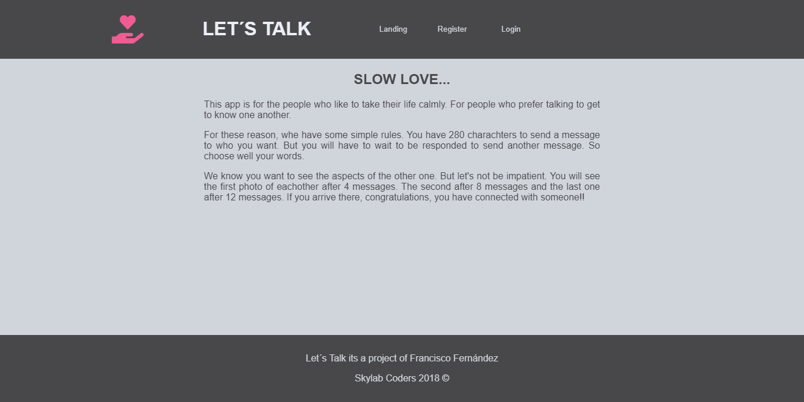
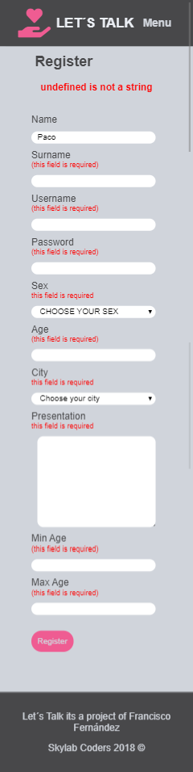
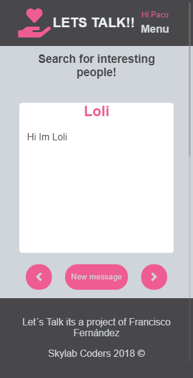
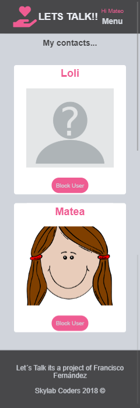
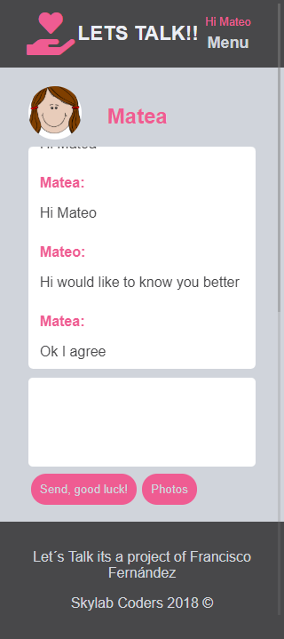

# Lets-Talk documentation

## [Documentation](lets-talk-docs/Readme.md)

## Group components

- Paco [Pacoscript](https://github.com/Pacoscript)

## Public URL

http://lets-talk.surge.sh
* You can register a new user, male or female. If you choose city Barcelona, and age between 20 and 30 years old. You will see others users in the application.

## ScreenShots

# Landing

# Register
* You can register a user, especifying your age and the range of age you are looking for. And the city. With this info the page search candidates for you. The app is responsive we show this screen in mobile mode.

# Candidates
* You can pass candidates, when you find one you like her/his description yo can sen an unic message.

# Contacts
* You can see your contacts in the contact screen

# Chat
* You can chat with the other person. But you can only can send one message until the other responde you. If you maintain a conversation with several messages you will see the photos of the other one.

